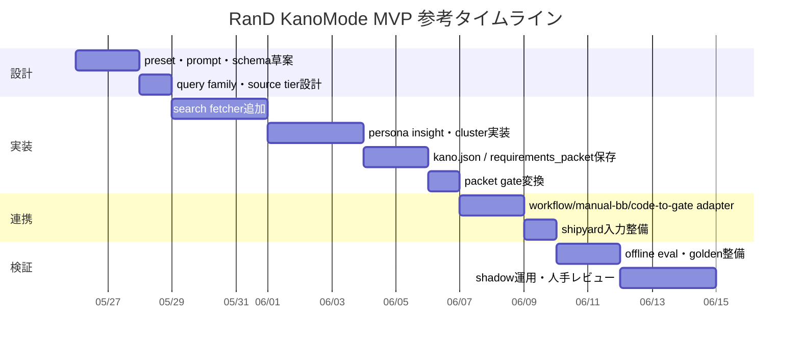

# RanD向けKanoMode拡張の実装調査レポート

## エグゼクティブサマリー

結論から言うと、**新しいOSSを起こすより、RanDの中に軽量なKanoModeアダプタを追加する方が筋が良い**です。理由は明確で、RanDにはすでに、JSON presetの読み込み、CLIからのpreset実行、`run_insight`→`run_gate`→成果物保存という実行線、そして `report.json` / `insight.json` / `gate.json` / `meta.json` / `tracker_sync.json` / `memx_journal.json` / `state_context.json` を保存する成果物レイヤが揃っているからです。つまり、KanoModeは「新しい基盤」ではなく、**既存のresearch-runtimeに新しい調査モードと成果物契約を差し込む拡張**として実装するのが最小変更になります。 citeturn10view3turn18view0turn36view0turn12view2turn15view4

ただし、**「RanDにKanoModeというフラグを1個足せば終わり」ではありません。** 本当に必要なのは、少なくとも次の束です。  
**preset追加、Kano向けprompt、検索クエリ型の証拠収集、persona切替、`kano.json` と `requirements_packet.json` の保存、そして gate への変換**です。特に重要なのは検索面で、現状のRanD fetcherは `arxiv_recent_html`、`generic_html_links`、`rss_or_html` の3種類しかなく、URL seed中心です。ユーザーの不満・称賛・比較・離脱理由のような**Kanoに効く証拠を集めるには、検索クエリ駆動のfetcherか、`open_deep_research` を使う検索アダプタが必須**です。 citeturn22view0turn22view1turn22view2turn22view3turn37view1

また、Kano自動化は研究上も成立可能性がありますが、**精度限界と文脈欠落を前提にした設計**が必要です。Kanoモデルの原典は1984年の「魅力的品質と当り前品質」にあり、要件が満足度に与える非対称性を捉える枠組みです。近年ではアプリレビューからKano因子を自動分類する研究があり、2023年の研究ではBERT系分類器が10-fold CVで0.928、独立データセットでは0.725の精度を示しましたが、**一般化性能の低下、レビューの文脈不足、人間ラベル間不一致との相関**も報告されています。さらに、2020年の研究は、**ユーザー期待が時間と競争環境で変化する**ことを、時系列レビュー分析で示しています。したがって、KanoModeは「分類器」よりも、**証拠束を集め、信頼度・バイアス・反証条件付きで要件パケットに変換する支援器**として設計するべきです。 citeturn24search1turn39academia14turn23search1

周辺OSSとの相性も良好です。`workflow-cookbook` は Task Seed、Acceptance、Evidence、CI/Governance を持ち、メトリクス閾値検証や acceptance sync、release evidence 生成ができます。`manual-bb-test-harness` は coverage model 起点で feature spec / test model / manual case / gate decision まで扱うスキル群とJSON Schemaを持っています。`code-to-gate` は `risk-register.yaml`、`test-seeds.json`、`release-readiness.json` を生成し、`readiness` では `--intake` に phase contract を渡せます。`shipyard-cp` は `plan -> dev -> acceptance -> integrate -> publish` の段階で CLI-first に orchestration できます。つまり、**RanDでKano-driven requirements packetを作り、周辺OSSに流す構成は、既存資産に非常によく乗ります。** citeturn28view0turn29view1turn29view2turn26view0turn31view3turn27view6turn32view0turn33view0turn30view0turn30view1turn30view4

## 前提と現状把握

まず、未指定事項を明示します。本レポートでは、未指定のものはそのまま**「未指定」**として扱い、実装計画では参照用の仮定だけを置きます。

| 項目 | 状態 | 本レポートでの扱い |
|---|---|---|
| チーム規模 | 未指定 | 参考タイムラインは「小規模実装」を想定 |
| 対象プロダクト領域 | 未指定 | Web / SaaS / 開発ツール系にも流用できる汎用設計として提案 |
| 期限 | 未指定 | MVP基準の参照タイムラインを提示 |
| 強制ソース制約 | 未指定 | 一次情報優先、ユーザー証跡は補助・対照として提案 |
| 人手レビュー予算 | 未指定 | 小さな人手ラベル付きpilotを推奨 |
| 既存の正解データセット | 未指定 | offline eval用にfixtures/キャッシュを持つ前提で提案 |
| リリース厳格度 | 未指定 | must-beは hard gate、attractiveは soft gate を基準提案 |
| 対応言語 | 未指定 | ja-JP中心、必要に応じて英日混在検索を推奨 |

RanDの現状を見ると、research-runtimeは「論文・AIニュースを収集し、構造化し、必要に応じて評価し、成果物とstateを保存する」役割で、`open_deep_research` 前提のsource preset管理、`insight-agent` / `experiment-gate` / `agent-taskstate` の接続、さらに `memx-resolver` と `tracker-bridge-materials` への連携を担うとREADMEに明記されています。ルートのREADMEでも、Kestra経由の正規E2Eが `research -> insight -> gate -> sync -> notify` であること、`research-manual-run.yaml`、`research-ai-watch-daily.yaml`、`research-arxiv-nightly.yaml`、`research-heartbeat.yaml` が現在のflowであることが示されています。 citeturn5view0turn25search2

実装差し込み点もはっきりしています。`load_preset()` は `configs/presets/<name>.json` をそのまま読み込むだけなので、新presetの追加コストは非常に低いです。runtime設定側でも `enable_gate`、`enable_insight`、`enable_memx`、`enable_tracker_bridge` が明示されており、既存の実行線を流用できます。CLI側も `run-once --preset` が基本導線なので、**MVPではCLI改修なしでも preset追加だけで運用開始可能**です。 citeturn10view3turn18view0turn36view0

一方で、KanoModeにそのまま足りない部分も明白です。`build_insight_payload()` は現在、単一の `NormalizedItem` から `"mode": "insight"` のpayloadを作り、`run_insight()` は各itemについて `insight_core.run(request_dict=payload)` を呼ぶ構造です。つまり今のRanDは、**複数証拠を一つの要求候補へ束ねてKano分類する設計にはなっていません。** また `run_gate()` は `high_priority` なitem上位3件だけを実験ゲートに流し込むため、**要件パケット全体をgateする設計ともズレがあります。** citeturn12view0turn12view1

軽量アダプタ案と新OSS案を比較すると、判断はかなりはっきりしています。次表は、本リポジトリ群の現状に照らした分析です。RanDのpreset、pipeline、artifact保存、周辺OSSのschema・gate・orchestrationを使えるため、最初の一手は**RanD内軽量アダプタ**が優位です。 citeturn12view2turn15view4turn29view2turn31view3turn33view0turn30view1

| 設計案 | 変更面積 | 長所 | 短所 | 推奨度 |
|---|---:|---|---|---|
| RanD内の軽量KanoModeアダプタ | 小 | preset追加・artifact拡張・persona切替で開始できる。既存の `run_insight` / `run_gate` / `save_run_outputs` を活かせる | search fetcher と packet化ロジックは自前追加が必要 | 高 |
| 新しい専用OSSを別建て | 大 | 将来的に独立製品化しやすい | RanDとの境界、evidence契約、task/gate連携が二重化しやすい | 低 |
| RanD内で始めて、後に抽出 | 中 | 今すぐ進めつつ、将来独立も可能 | 境界設計を最初から意識する必要あり | 中 |

この観点から、**「KanoModeをRanDに出すだけでよいか？」への実務的回答は、**  
**MVPの方向性としてはほぼYes**、ただし**“KanoMode”の中身を preset + search + persona + artifact + packet gate まで含めて定義するなら**、という条件付きです。単なる mode フラグだけでは足りません。 citeturn10view3turn22view0turn12view1turn15view4

## KanoModeの目標アーキテクチャ

本件の狙いは、「ユーザー要求をKano分類すること」そのものではなく、**Kano分類を使って、もっともらしい要求定義パケットを高確率で作ること**です。そのため、KanoModeの主成果物は `kano.json` ではなく、最終的には **`requirements_packet.json`** であるべきです。`kano.json` はその中間成果物で、証拠・信頼度・バイアス・反証条件を保持するための分析台帳として扱うのが最も扱いやすいです。これは、RanDが現在 `insight.json` と `gate.json` を独立に保存している設計と整合的です。 citeturn15view0turn15view4

推奨する処理順は、次の通りです。  
**collect → normalize → evidence cluster → persona insight → kano classify → requirements packet → packet gate → sync/export**。  
このうち、collect / normalize / sync/export はRanD既存部品、packet gate は既存 `experiment-gate` の再利用、そして新規実装の主眼は **evidence cluster / persona insight / kano classify / requirements packet** です。RanDは `ensure_repo_paths()` で `open_deep_research`、`insight-agent`、`experiment-gate`、`agent-taskstate`、`memx-resolver`、`tracker-bridge-materials` を探索対象に入れており、peer repo連携前提の構造になっています。 citeturn37view1turn37view2turn37view3

persona mode は、1回の巨大promptより、**役割別に薄く分ける**方が良いです。理由は、研究者目線・ユーザー目線・gatekeeper目線・product目線は、同じ証拠を見ても出したいアウトプットが違うからです。`experiment-gate` 側も、仮説・PoC仕様・evidence bundle・assumptions・known risks を入力として判断する設計なので、KanoModeでも同じく**役割ごとの視点を明示した方が downstream gate と噛み合います。** citeturn38view0

推奨する persona mode は次の4つです。

| persona mode | 主な問い | 主出力 | 主な使い先 |
|---|---|---|---|
| researcher | 何が繰り返し語られているか。どの要求候補が見えるか | 証拠クラスタ、要求候補、未解決論点 | `kano.json` の基礎 |
| user | ある要素が「無いと困る」のか「あるとうれしい」のか | 満足/不満の非対称、利用文脈、感情極性 | Kano分類の一次推定 |
| gatekeeper | 何が release blocker で、どこに過信があるか | must-be強制、confidence上限、kill condition | `gate.json`、hard/soft gate |
| product | 何を要求文、KPI、受入条件、優先度に落とすべきか | 要求文、KPI仮説、acceptance、sequence | `requirements_packet.json` |

実装上の肝は、**単一itemではなく「要求候補クラスタ」単位で insight をかけること**です。現在の `build_insight_payload()` は1 item = 1 sourceですが、payload自体は `"sources": [...]` を取れる形なので、ここを拡張し、**複数の complaint / praise / compare / official / issue を1クラスタに束ねて渡す**設計にするのが最小変更です。つまり `run_insight(items)` を `run_kano_insight(clusters, mode_config)` に寄せるか、`run_insight()` の中で preset を見て clustering branch を持たせれば、pipeline全体を大きく崩さずに済みます。 citeturn12view0turn12view1

gateの扱いも、現状の「高優先item上位3件を小さなPoC候補として `experiment-gate` に流す」方式から、**requirements packet全体を1つの仮説とみなして gate する**方向へ寄せた方が良いです。`experiment-gate` は `GateRequest` に hypothesis、`PocSpec`、`EvidenceBundle`、assumptions、known_risks を持てるため、`requirements_packet.json` の上位要求・KPI・リスクをそこへ写像すれば再利用可能です。したがって、新しいgate OSSは不要で、**RanD側に packet-to-GateRequest 変換を1枚足す**のが合理的です。 citeturn12view1turn38view0

## 検索戦略とアーティファクト設計

KanoModeの成否は、分類器よりも**証拠収集戦略**で決まります。2023年の自動分類研究でも、レビューからKano因子を抽出すること自体は可能でしたが、独立データで0.725まで性能が落ち、文脈欠落が本質的な制約だと述べられています。したがって、**単一ソースの極端な意見をそのまま採らず、複数ソース・複数表現・複数視点を束ねる検索戦略**が必須です。さらに、2020年の時系列レビュー研究が示すように、期待は時間とともに変わるため、**Kano判定には freshness weighting と time slicing を入れるべき**です。 citeturn39academia14turn23search1

現行RanDにはクエリ検索型fetcherがないので、ここは新設が必要です。具体的には `fetchers.py` に **`search_query` あるいは `web_evidence_search`** のようなfetcherを追加し、presetから `query_family` と `domains_allow` と `freshness_window_days` を与える形がよいです。これは、現在 `collect_source()` が `arxiv_recent_html`、`generic_html_links`、`rss_or_html` にしか分岐していないためです。 citeturn22view0turn22view1turn22view2turn22view3

推奨する query family は次の通りです。これは本レポートの設計提案ですが、**Kanoの「欠如時の不満」「充足時の満足」「競争比較」「時間変化」**を拾うための構造として妥当です。 citeturn24search1turn34search1turn39academia14turn23search1

| query family | 典型表現例 | 狙うKano信号 | 優先ソース tier | 主な注意点 |
|---|---|---|---|---|
| complaints | 使いにくい、困る、遅い、壊れる、面倒、致命的、deal breaker | must-be / reverse の兆候 | issue tracker、support forum、生レビュー | ネガティブ極性に偏りやすい |
| praise | 最高、便利、速い、助かる、神、love | performance / attractive の兆候 | reviews、SNS、community | 一時的バズを過大評価しやすい |
| compare | A vs B、乗り換え、better than、switched from | performance の競争軸 | comparison記事、GitHub discussion、レビュー | SEOノイズが多い |
| expectation | 当たり前、普通、最低限、must have、should | must-be の明示表現 | docs、issue、レビュー | 期待水準は時間で変わる |
| delight | これは意外と良い、驚いた、would be nice、nice to have | attractive の兆候 | praise、feature request | 「欲しい」と「使う」は別 |
| churn / regret | やめた、解約した、二度と使わない、離脱理由 | must-be欠落 / reverse | support、review、community | 不満理由が複合要因になりやすい |
| official claims | 公式機能説明、release note、仕様書 | 実装済み/約束済みの確認 | 一次情報 | ポジティブバイアスが強い |
| competitor baseline | 競合が標準提供、業界標準、baseline | must-be化の兆候 | competitor docs、比較記事 | セグメント違いに注意 |

日本語ユーザー向けには、**日本語クエリを主、英語クエリを補助**にするのが妥当です。具体的には、同一の query family に対して `[ja-JP, en-US]` の query template を持ち、source metadata に `locale` と `segment` を残します。そうしないと、グローバル製品では英語圏のdelighterを日本語市場のmust-beと誤認したり、その逆が起きやすくなります。これは設計上の推奨であり、上の時系列研究と自動分類研究が指摘する「文脈依存性」と整合します。 citeturn39academia14turn23search1

成果物設計は、**`kano.json` を分析台帳、`requirements_packet.json` を実務契約**として分けるべきです。RanDも `SCHEMA_VERSION = "1.0"` の統一スキーマバージョンを使っており、manual-bb-test-harness も `feature_spec.schema.json`、`test_model.schema.json`、`manual_case_set.schema.json`、`gate_decision.schema.json` を備えています。したがって、こちらも schema-first で設計し、**必ず `schema_version` を持たせる**のがよいです。 citeturn35view0turn31view3

提案する `kano.json` の最小形は、次のようなものです。

```json
{
  "schema_version": "1.0",
  "mode": "kano",
  "request_id": "kano-20260525-001",
  "topic": "RanD KanoMode requirements gate",
  "persona_modes": ["researcher", "user", "gatekeeper", "product"],
  "source_summary": {
    "total_evidence": 18,
    "primary_source_count": 5,
    "user_signal_count": 9,
    "comparison_source_count": 4,
    "freshness_window_days": 180
  },
  "kano_candidates": [
    {
      "candidate_id": "KC-001",
      "statement": "初回セットアップは20分以内で完了できるべきである",
      "kano_type": "must_be",
      "confidence": 0.84,
      "evidence": [
        {
          "evidence_id": "EV-001",
          "source_type": "complaint",
          "source_tier": "user_signal",
          "source_ref": "github_issue_or_review_001",
          "summary": "初期設定が重く、導入を途中で断念したという不満",
          "weight": 0.82,
          "freshness_days": 12
        },
        {
          "evidence_id": "EV-002",
          "source_type": "official",
          "source_tier": "primary",
          "source_ref": "official_setup_doc_001",
          "summary": "公式導線でも短時間セットアップを価値として訴求している",
          "weight": 0.74,
          "freshness_days": 30
        }
      ],
      "persona_votes": {
        "researcher": "must_be",
        "user": "must_be",
        "gatekeeper": "must_be",
        "product": "must_be"
      },
      "bias_note": "公開レビューはネガティブ極性に寄りやすい。ヘビーユーザーの声が多い可能性がある。",
      "kill_condition": "オンボーディング完了率が継続的に95%以上で、離脱理由上位から設定複雑性が外れた場合は再分類する。",
      "open_questions": [
        "モバイルとデスクトップでセットアップ期待値は同じか"
      ]
    },
    {
      "candidate_id": "KC-002",
      "statement": "要件パケットに自動でKPI草案が付くと嬉しい",
      "kano_type": "attractive",
      "confidence": 0.67,
      "evidence": [
        {
          "evidence_id": "EV-003",
          "source_type": "praise",
          "source_tier": "user_signal",
          "source_ref": "community_post_014",
          "summary": "数値指標まで提案されると意思決定が速いという称賛",
          "weight": 0.63,
          "freshness_days": 8
        }
      ],
      "persona_votes": {
        "researcher": "attractive",
        "user": "attractive",
        "gatekeeper": "performance",
        "product": "attractive"
      },
      "bias_note": "肯定意見が少数で、導入済みの高度ユーザーに偏っている可能性がある。",
      "kill_condition": "利用者インタビューでKPI自動草案に価値が無いことが確認された場合は要件から外す。",
      "open_questions": [
        "KPI草案は全件必要か、上位要求のみで十分か"
      ]
    }
  ],
  "known_biases": [
    "一次情報はポジティブバイアスを含む",
    "公開レビューは極端意見に寄りやすい"
  ]
}
```

`requirements_packet.json` は、周辺OSSへ渡す実務契約として、KPI・acceptance・risk・downstream hook を含めるのがよいです。`code-to-gate` が `readiness`、`evidence`、`schema validate` を持ち、`manual-bb-test-harness` が feature spec / gate decision へ落とせるので、**人が読むだけでなく、次工程のツールが消費できる形**にしておくのが重要です。 citeturn33view0turn31view3

```json
{
  "schema_version": "1.0",
  "packet_id": "rp-20260525-001",
  "derived_from": "kano.json",
  "product_context": {
    "name": "RanD KanoMode",
    "domain": "未指定",
    "target_segment": "未指定",
    "locales": ["ja-JP", "en-US"]
  },
  "assumptions": [
    "チーム規模は未指定",
    "対象プロダクトはソフトウェア要件定義支援であると仮定する",
    "live web evidence を取得できる実行環境がある"
  ],
  "requirements": [
    {
      "requirement_id": "REQ-001",
      "title": "検索証拠ベースのKano分類",
      "statement": "システムは、一次情報と公開ユーザー証跡を組み合わせて要件候補ごとのKano分類を生成しなければならない。",
      "kano_type": "must_be",
      "priority": "P0",
      "confidence": 0.84,
      "evidence_refs": ["KC-001", "EV-001", "EV-002"],
      "kpi": [
        {
          "name": "evidence_precision_at_5",
          "target": ">=0.80",
          "measurement": "人手評価"
        },
        {
          "name": "requirement_packet_accept_rate",
          "target": ">=0.70",
          "measurement": "レビュー会で採択された要求比率"
        }
      ],
      "acceptance_criteria": [
        "各要件に2件以上の evidence_refs が付与される",
        "confidence, bias_note, kill_condition が空でない",
        "must_be 要件は少なくとも1件の一次情報または直接的ユーザー不満証跡を持つ"
      ],
      "risks": [
        "検索結果のSEOノイズに引きずられる",
        "レビュー文脈不足により誤分類する"
      ],
      "manual_bb_focus": [
        "証拠ゼロ",
        "相反証拠",
        "日本語のみ",
        "競合比較のみ"
      ],
      "downstream_hooks": {
        "workflow_cookbook": "task_seed_and_evidence",
        "manual_bb_test_harness": "feature_spec_and_test_model",
        "code_to_gate": "phase_contract_or_intake",
        "shipyard_cp": "plan_stage_task"
      },
      "bias_note": "公開レビューは極端意見に寄りやすい。",
      "kill_condition": "live web evidence なしでも同等精度を満たせると確認された場合、web依存設計を縮小再設計する。"
    },
    {
      "requirement_id": "REQ-002",
      "title": "要求ごとのKPI草案自動生成",
      "statement": "システムは、performance または attractive に分類された要件について、少なくとも1件のKPI草案を提案してもよい。",
      "kano_type": "attractive",
      "priority": "P2",
      "confidence": 0.67,
      "evidence_refs": ["KC-002", "EV-003"],
      "kpi": [
        {
          "name": "kpi_edit_rate",
          "target": "<=0.50",
          "measurement": "採択前に書き換えられた比率"
        }
      ],
      "acceptance_criteria": [
        "KPI草案は数値化可能な観測対象を持つ",
        "must_be が未充足のとき attractive を hard gate にしない"
      ],
      "risks": [
        "魅力品質を過度に固めてしまう"
      ],
      "manual_bb_focus": [
        "KPI草案が空論化しないか"
      ],
      "downstream_hooks": {
        "workflow_cookbook": "metrics_and_acceptance_draft",
        "manual_bb_test_harness": "exploratory_charter_seed",
        "code_to_gate": "non_blocking_readiness_note",
        "shipyard_cp": "optional_plan_item"
      },
      "bias_note": "高度ユーザーの好みに偏る可能性がある。",
      "kill_condition": "pilotで採択率が低く、編集コストが高い場合は機能縮小する。"
    }
  ],
  "release_readiness_prelude": {
    "status": "draft",
    "preconditions": [
      "offline eval を通す",
      "manual review で有用性を確認する"
    ]
  }
}
```

Kano type を requirement / KPI / acceptance / risk にどう写像するかは、プロダクト化で最も重要です。以下は**本レポートの推奨マッピング**です。Kanoの原理と、must-be / one-dimensional / attractive / indifferent / reverse の実務解釈に基づく設計提案です。 citeturn24search1turn34search1turn34search14turn34search18

| Kano type | 要求定義での扱い | KPIの置き方 | Acceptanceの強さ | 主リスク |
|---|---|---|---|---|
| must-be | 必須要求。未充足を許さない | 失敗率、欠陥率、完了率、しきい値遵守 | hard gate | 欠如で不満が大きく、release blockerになる |
| performance | 競争軸。上げるほど満足が上がる | レイテンシ、精度、工数、成功率の改善量 | threshold gate | 競争力不足、改善投資の優先度誤り |
| attractive | 差別化要素。あると喜ばれる | 採用率、再利用率、称賛率、CV uplift | soft gate / experiment gate | 過剰実装、魅力品質の固定化 |
| indifferent | 原則保留。要求化しない | KPI不要か、観測のみ | acceptance対象外 | 過剰開発、ノイズ注入 |
| reverse | デフォルト搭載を避ける。設定化やセグメント分離 | 苦情率、OFF率、離脱率 | negative gate | 付けるほど満足を下げる |
| questionable | データ品質問題として扱う | KPIより再調査指標 | gate禁止 | 誤分類を要求に昇格すること |

この表で特に重要なのは、**must-be を KPI改善案件ではなく「最低限の欠如防止」へ、attractive をリリース必須条件ではなく「実験・差別化枠」へ置くこと**です。これを明示しないと、Kano分類しても要件優先順位が崩れます。これは実装上 `priority`, `acceptance_strength`, `risk_class`, `gate_policy` といった計算済みfieldを packet に埋めると扱いやすくなります。これは本レポートの推奨設計です。 citeturn24search1turn34search1turn23search1

## OSS統合と実装計画

周辺OSSとの統合は、**“全部を同時にしゃべる”より、“requirements_packet を共通入口にする”**方が安定します。`workflow-cookbook` は Task Seed / Acceptance / Evidence / release evidence を持ち、`manual-bb-test-harness` は feature spec / test model / manual case / gate decision を持ち、`code-to-gate` は readiness と evidence を持ち、`shipyard-cp` は plan/dev/acceptance/integrate/publish の段階を持つため、**RanDの外に出す共通契約は `requirements_packet.json` 1つを主にし、各OSS向けに薄い adapter を置く**のが一番崩れにくいです。 citeturn29view1turn29view2turn31view3turn33view0turn30view1

統合の推奨形は次の通りです。

| 連携先OSS | KanoModeから渡すもの | そこで得るもの | 使い方 |
|---|---|---|---|
| workflow-cookbook | requirements packet、evidence refs、KPI草案 | Task Seed、Acceptance草案、evidence report、metrics threshold check | 要件定義の運用正本化 |
| manual-bb-test-harness | must-be/performance中心の要求、risk、acceptance | feature_spec、test_model、manual_case_set、gate_decision | 要件の妥当性を手動ブラックボックスで炙る |
| code-to-gate | phase contract/intake、acceptance、risk | risk-register、test-seeds、release-readiness | 実装後のコード妥当性確認 |
| shipyard-cp | requirements packetをplan-stage inputとして投入 | task/run/gate/auditの実行線 | 超高速実装と段階的統制 |
| experiment-gate | packetを要約したGateRequest | go / hold / no_go | 実装前の要求定義ゲート |

それぞれの根拠を見ると、`workflow-cookbook` は README で Task Seed、Acceptance、Evidence、CI/Governance、plugin integration、metrics threshold validation、acceptance sync、release evidence report を持つことが示されています。`manual-bb-test-harness` は coverage model 起点の手動設計、`scripts/evaluate-gate.py` による gate 判定、自前の artifact schema 群を持っています。`code-to-gate` は `readiness`、`evidence`、`schema validate` を持ち、`risk-register.yaml`、`test-seeds.json`、`release-readiness.json` を出力します。`shipyard-cp` は plan/dev/acceptance/integrate/publish を明示段階として扱う control plane です。 citeturn29view1turn29view2turn31view0turn31view2turn31view3turn33view0turn30view0turn30view1turn30view4

presetは最低3種類あると実務で回しやすいです。RanDはpreset JSON読込が非常に単純なので、ここはリポジトリ設計に素直に従うのが良いです。 citeturn10view3turn19view0turn20view1turn20view2

| 推奨preset名 | 用途 | 証拠源 | 既定persona | 推奨状態 |
|---|---|---|---|---|
| `kano_requirements_hybrid` | 既定運用 | 一次情報 + complaint/praise/compare | researcher + user + gatekeeper + product | 推奨デフォルト |
| `kano_requirements_web_fast` | 素早い探索 | web検索重視、件数少なめ | researcher + user | 速報・叩き台用 |
| `kano_requirements_offline_eval` | 再現性評価 | fixture/cached corpusのみ | researcher + gatekeeper | CI/回帰評価用 |
| `kano_requirements_gatekeeper` | 既存researchの再判定 | RanD既存収集結果中心 | gatekeeper + product | 要件ゲート用 |

最小実装の考え方は、**新規APIよりも preset-driven で始める**ことです。CLIは現状 `run-once --preset` で回せるため、最初の段階では以下で十分です。  
`python -m rand_research.cli run-once --preset kano_requirements_hybrid`  
それでも operator ergonomics が欲しくなった時点で、`--persona` や `--offline-eval` といったCLI引数を足せばよい、という順番が合理的です。 citeturn36view0turn36view4

参照用の最小タイムラインは、未指定条件の中では次のくらいが現実的です。これは**小規模MVPの参考スケジュール**であり、確定日程ではありません。



なお、Kestra運用を続けるなら、root flow群に **`research-kano-requirements.yaml`** ないし既存 manual-run flow へのpreset追加を行うのが自然です。RanDのルートREADMEが現在のflow名を公開しているため、運用上も増設位置は明確です。 citeturn25search2

## 検証戦略とPRチェックリスト

検証は、**offline eval** と **live web shadow eval** を分けるべきです。理由は、Kano分類は文脈依存で揺れやすく、2023年研究でも一般化性能が大きく下がっているからです。したがって、「webで取れたから正しい」ではなく、**固定コーパスで回帰を押さえた上で、live evidence がどこを改善し、どこでノイズを増やすかを見る**必要があります。 citeturn39academia14turn23search1

推奨する検証マトリクスは、次の通りです。

| 検証軸 | offline eval | live web shadow | 合格の考え方 |
|---|---|---|---|
| Kano分類妥当性 | 人手ラベル比較 | 人手レビュー比較 | triageに使える水準であること |
| 証拠品質 | relevance / support判定 | source diversity / freshness判定 | 要件に対し証拠が支えていること |
| packet有用性 | レビュー会で採択率 | 実案件レビュー採択率 | 実際に使われること |
| downstream適合性 | schema validate | 実ツール投入 | workflow/manual-bb/code-to-gateに食わせられること |
| 安定性 | fixture差分比較 | 日次/週次再実行差分 | 同じ入力で荒れないこと |
| バイアス検知 | bias_note網羅 | 反証実験 | 過信せず止まれること |

メトリクスは、`workflow-cookbook` の metrics threshold 検証、acceptance sync、release evidence 生成と組み合わせるのがよいです。KanoMode単体で完璧を目指すのではなく、**「採択される要求パケットが増えたか」「manual-bbで抜けが減ったか」「code-to-gateで後段差し戻しが減ったか」**を見る方が、実装価値を測れます。`manual-bb-test-harness` は coverage model 起点で仕様不足や状態遷移の抜けを見つける方針を明示しており、`code-to-gate` は risk-register / test-seeds / release-readiness を出すため、KanoModeの評価はこの2つを使った**下流妥当性**まで含めるべきです。 citeturn29view1turn29view2turn31view0turn31view2turn33view0

失敗モードは、あらかじめ field設計で潰しておくのが重要です。

| 失敗モード | 典型症状 | 主原因 | 推奨緩和策 |
|---|---|---|---|
| complaint bias | must-be が過剰に増える | ネガティブレビュー偏重 | primary + user signal 混在を要求、confidence上限を設ける |
| praise illusion | delighter が乱立する | バズ・熱心な支持者の声 | adoptionや反復言及が弱い場合は attractive にしても P2以下に置く |
| compare SEO drift | performance軸が歪む | SEO比較記事ノイズ | domain allowlist、比較系は補助証拠に降格 |
| context missing | 分類がぶれる | レビュー断片に文脈がない | bias_note必須、kill_condition必須、人手レビュー対象へ送る |
| temporal drift | 昨年のdelighterを今年もdelighter扱いする | 期待変化 | freshness weighting、time slicing、再実行 |
| segment collapse | 日本語市場と英語市場を混同 | locale/segment未分離 | `locale`, `platform`, `segment` を evidence metadata へ保存 |
| gate overreach | attractive まで hard gate される | mapping不備 | must-be以外は原則 soft gate、experiment gate に留める |
| false certainty | LLMがもっともらしく断定する | 証拠不足でも文章は強い | confidence / bias_note / kill_condition 未充足なら packet昇格禁止 |

このうち、**confidence・bias_note・kill_condition を必須fieldにする**ことが最重要です。2023年研究が示す通り、レビューベースKanoは軽量で有用ですが限界も明確なので、要件パケットに「どれだけ確からしいか」「どんな偏りがありうるか」「何が起きたらこの要求を捨てるか」を埋め込む設計が必要です。 citeturn39academia14

最後に、RanD側での具体的なPR順序を、**最小で筋の良い順**に並べます。ここが実装上いちばん重要です。

| 優先度 | PR名 | 変更対象ファイル | 目的 | 備考 |
|---|---|---|---|---|
| P0 | presetとpromptの追加 | `research-runtime/configs/presets/*.json`, `research-runtime/prompts/*` | Kano用の実行入口を作る | `load_preset()` が単純JSON読み込みなので入れやすい |
| P0 | search fetcher追加 | `research-runtime/src/rand_research/fetchers.py` | complaint/praise/compare系の証拠収集を可能にする | 現状fetcher不足の解消 |
| P0 | persona-aware insight拡張 | `research-runtime/src/rand_research/integrations.py` | cluster + persona + kano payload を生成する | `build_insight_payload()` の拡張が中心 |
| P0 | 新artifactの保存 | `research-runtime/src/rand_research/reports.py`, `pipeline.py` | `kano.json` と `requirements_packet.json` を保存する | 既存 artifact writer に追加 |
| P1 | packet gate変換 | `research-runtime/src/rand_research/integrations.py`, `pipeline.py` | packet を `experiment-gate` に流す | raw item gate と共存させる |
| P1 | schema / model整備 | `research-runtime/src/rand_research/models.py` | schema version と型の明確化 | downstream adapter の基礎 |
| P1 | examples / docs / README追記 | `README.md`, `docs/*`, `examples/*` | 運用導線を作る | presetごとの使い分け明記 |
| P1 | tests / goldens追加 | `research-runtime/tests/*` | offline eval, schema, integration回帰 | CIの信頼性確保 |
| P2 | CLI ergonomics | `research-runtime/src/rand_research/cli.py` | `--persona` など任意指定 | MVPでは後回し可 |
| P2 | schedule / flow追加 | `configs/schedule.json`, Kestra flow群 | 定期実行・batch運用 | root flowと整合させる |

このPR順序の根拠は、RanDの現行コード責務にあります。preset読込は `config.py`、実行線は `pipeline.py`、証拠収集は `fetchers.py`、insight/gate 連携は `integrations.py`、artifact保存は `reports.py`、CLI入口は `cli.py` にあり、役割分離がきれいだからです。 citeturn10view3turn12view2turn22view0turn12view0turn15view4turn36view0turn35view0

推奨する次の一手も、かなり明確です。  
**最初の1サイクルでは、P0だけを実装し、`kano_requirements_hybrid` で10〜20テーマのpilotを回す**のがよいです。そこで `requirements_packet_accept_rate`、manual-bbで見つかった追加欠落数、code-to-gateのblocked件数、レビュー会での修正率を見る。もしこのpilotで packet採択率が高く、must-be / performance / attractive の写像が実務上自然に機能するなら、その時点で初めて P1 の packet gate と shipyard 連携を深めるのがよいです。逆にpilotで「分類は出るが使われない」なら、先に改善すべきは分類器ではなく**query family と packet schema**です。これは、研究が示す精度限界と、周辺OSSが求める実務契約の両方を踏まえた、最もリスクの低い進め方です。 citeturn39academia14turn29view2turn31view0turn33view0turn30view1

要するに、本件の最終判断はこうです。  
**RanDにKanoModeを乗せる、という方向性は合っています。**  
ただし、実装単位としての“KanoMode”は、**単なるmode追加ではなく、検索証拠戦略・persona insight・artifact契約・packet gateまで含む軽量アダプタ束**として定義するのが正解です。そうすれば、新OSSを増やさず、既存の `workflow-cookbook`、`manual-bb-test-harness`、`code-to-gate`、`shipyard-cp` をそのまま活かしながら、要件定義ゲートを「研究っぽいもの」ではなく「実務に落ちるもの」に変えられます。 citeturn12view2turn15view4turn29view2turn31view3turn33view0turn30view1