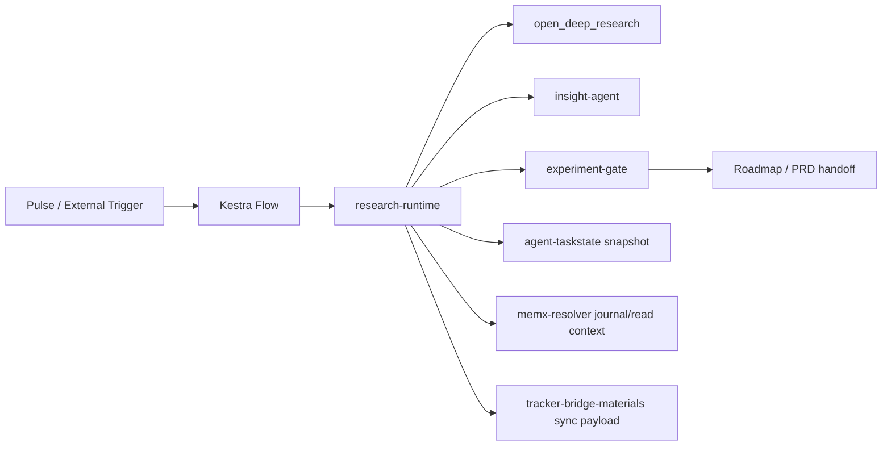
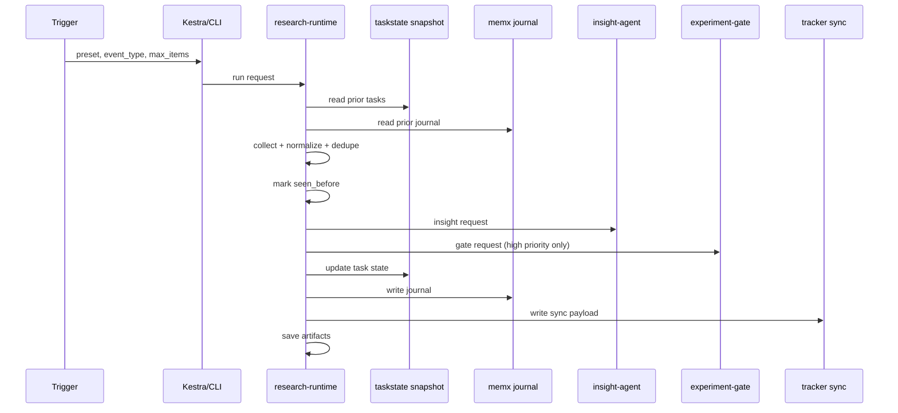

# RanD Specification

## 0. 文書情報

- 文書種別: specification
- 状態: active
- 対象: `RanD` root, `research-runtime`, `kestra/flows`
- 対応要求: [requirements.md](/Users/ryo-n/Codex_dev/RanD/docs/requirements.md)

## 1. 本書の位置づけ

本書は、RanD の実装構成、入出力契約、state-aware 実行、Kestra flow、異常系処理を定義する。

- 全体像: [architecture.md](/Users/ryo-n/Codex_dev/RanD/docs/architecture.md)
- 実装優先順位: [next-implementation-priorities.md](/Users/ryo-n/Codex_dev/RanD/docs/next-implementation-priorities.md)
- 要件: [requirements.md](/Users/ryo-n/Codex_dev/RanD/docs/requirements.md)
- 受け入れ基準: [evaluation.md](/Users/ryo-n/Codex_dev/RanD/docs/evaluation.md)

## 2. システム構成

### 2.1 レイヤ構成



### 2.2 ディレクトリ仕様

```text
RanD/
├─ docs/
│  ├─ architecture.md
│  ├─ next-implementation-priorities.md
│  ├─ requirements.md
│  └─ specification.md
├─ r-and-d-agent-installer/
├─ research-runtime/
│  ├─ configs/
│  ├─ prompts/
│  ├─ scripts/
│  ├─ src/rand_research/
│  ├─ state/
│  └─ runs/
├─ kestra/
│  ├─ README.md
│  └─ flows/
└─ *.bat
```

## 3. コンポーネント仕様

### 3.1 Installer

- 実装位置: [r-and-d-agent-installer](/Users/ryo-n/Codex_dev/RanD/r-and-d-agent-installer)
- 正本設定: [components.json](/Users/ryo-n/Codex_dev/RanD/r-and-d-agent-installer/manifests/components.json)
- 契約:
  - `name`
  - `repoUrl`
  - `pinnedCommit`
  - `optional`
  - 導入先は `.installed/repos/<name>`

### 3.2 Research Runtime

- 実装位置: [research-runtime](/Users/ryo-n/Codex_dev/RanD/research-runtime)
- 入口:
  - `python -m rand_research.cli run-once --preset <name> [--max-items N]`
  - `python -m rand_research.cli run-schedule`
  - `python -m rand_research.cli env-check`
- Windows 入口:
  - [run-research-once.bat](/Users/ryo-n/Codex_dev/RanD/run-research-once.bat)
  - [run-research-schedule.bat](/Users/ryo-n/Codex_dev/RanD/run-research-schedule.bat)

### 3.3 Kestra Flows

- 実装位置: [kestra/flows](/Users/ryo-n/Codex_dev/RanD/kestra/flows)
- flow:
  - [research-manual-run.yaml](/Users/ryo-n/Codex_dev/RanD/kestra/flows/research-manual-run.yaml)
  - [research-ai-watch-daily.yaml](/Users/ryo-n/Codex_dev/RanD/kestra/flows/research-ai-watch-daily.yaml)
  - [research-arxiv-nightly.yaml](/Users/ryo-n/Codex_dev/RanD/kestra/flows/research-arxiv-nightly.yaml)

## 4. データモデル仕様

### 4.1 Run Request

Kestra またはローカル実行から `research-runtime` へ渡す最小入力。

```json
{
  "event_type": "manual",
  "preset": "paper_arxiv_ai_recent",
  "max_items": 8,
  "source": "kestra.schedule.paper_arxiv_ai_recent"
}
```

制約:

- `preset` は preset JSON 名と一致すること
- `max_items` は 0 以上の整数
- `event_type` は `manual | schedule | heartbeat` のいずれか

### 4.2 NormalizedItem

```json
{
  "id": "arxiv-2603.00001",
  "kind": "paper",
  "source_name": "arXiv cs.AI recent",
  "url": "https://arxiv.org/abs/2603.00001",
  "title": "Example",
  "published_at": null,
  "authors": [],
  "summary": "...",
  "claims": [],
  "evidence": [],
  "tags": ["paper", "arxiv"],
  "priority": 8,
  "high_priority": true,
  "metadata": {
    "seen_before": false,
    "previous_run_count": 0
  }
}
```

必須キー:

- `id`, `kind`, `source_name`, `url`, `title`, `priority`, `high_priority`

### 4.3 ExecutionContext

```json
{
  "preset": "paper_arxiv_ai_recent",
  "previous_run_count": 2,
  "known_urls": ["https://arxiv.org/abs/2603.00001"],
  "recent_tasks": [
    {
      "task_id": "task-20260315-001",
      "run_id": "20260315-001",
      "status": "done",
      "updated_at": "2026-03-15T10:00:00Z",
      "summary": "8 items collected"
    }
  ],
  "open_tasks": [],
  "recent_memory_entries": []
}
```

意味:

- `previous_run_count`: same preset の過去 task 数
- `known_urls`: same preset で既読扱いの URL 群
- `recent_tasks`: 直近 task digest
- `open_tasks`: `done`, `archived` 以外の task digest
- `recent_memory_entries`: journal の最近エントリ

### 4.4 Tracker Sync Payload

`tracker-bridge-materials` 向けに RanD が生成する最小 payload。

```json
{
  "sync_id": "sync-20260315-001",
  "recorded_at": "2026-03-15T10:30:00Z",
  "preset": "ai_watch_daily",
  "items": [
    {
      "title": "Example News",
      "url": "https://example.com/news",
      "kind": "news",
      "priority": 8
    }
  ],
  "gate_recommendations": [
    {
      "request_id": "arxiv-2603.00001",
      "verdict": "go",
      "recommended_action": "run_minimal_probe"
    }
  ]
}
```

### 4.5 Artifact Contract

1 run あたり次のファイルを生成する。

| ファイル | 内容 |
| --- | --- |
| `report.md` | 人間向け概要 |
| `report.json` | collected items と参照関係 |
| `insight.json` | insight worker 出力 |
| `gate.json` | gate worker 出力 |
| `meta.json` | run metadata |
| `memx_journal.json` | memory journal entry |
| `tracker_sync.json` | tracker sync event |
| `state_context.json` | before / after snapshot |

## 5. 実行仕様

### 5.1 正常系シーケンス



### 5.2 実行前処理

入力:

- preset 定義
- runtime 設定
- `state/taskstate.json`
- `state/memx-journal.json`

処理:

1. preset を読み込む
2. same preset の task を抽出する
3. same preset の memory journal を抽出する
4. `ExecutionContext` を組み立てる
5. `queued` 状態の task record を作成する

### 5.3 収集・正規化

許可 fetcher:

- `arxiv_recent_html`
- `generic_html_links`
- `rss_or_html`

処理ルール:

- URL 優先で重複除去する
- URL が無い場合は title を代替キーにする
- `ExecutionContext.known_urls` に存在する URL は既読扱いにする
- 既読 item は `high_priority=false` に落とす
- 既読 item は `previously_seen` タグを付与する

### 5.4 Insight/Gate

- insight 入力は item 単位
- gate 入力は `high_priority=true` の上位候補のみ
- worker import 失敗時は fallback を返す
- fallback でも artifact 保存は継続する

### 5.5 実行後処理

処理順:

1. memory journal を更新する
2. tracker sync payload を更新する
3. `done` または `needs_review` へ task state を更新する
4. `state_context.after` を再取得する
5. artifact を再保存して before / after を固定する

## 6. Kestra Flow 仕様

### 6.1 research-manual-run

目的:

- webhook で任意 preset を実行する

入力 payload:

```json
{
  "event_type": "manual",
  "preset": "paper_arxiv_ai_recent",
  "max_items": 8,
  "source": "operator.webhook"
}
```

処理:

1. payload をログ出力する
2. `research-runtime` を subprocess で実行する
3. stdout の JSON を `report.json` として保存する
4. `state_context` を `state_context.json` として保存する

失敗時:

- subprocess 非 0 終了で flow は失敗とする
- Kestra 側 retry は別 flow policy に委譲する

### 6.2 research-ai-watch-daily

- trigger: `0 8 * * *`
- 処理: `research-manual-run` webhook を呼び、`ai_watch_daily` を起動する
- 出力: manual flow 側に委譲する

### 6.3 research-arxiv-nightly

- trigger: `0 23 * * *`
- 処理: `research-manual-run` webhook を呼び、`paper_arxiv_ai_recent` を起動する
- `event_type` は `heartbeat` として扱う

## 7. 異常系仕様

### 7.1 Source Fetch Failure

条件:

- source URL 取得失敗
- RSS parse failure

動作:

- source 単位 error を `meta.errors` に格納する
- 他 source の収集は継続する
- 完了時 status は `needs_review` を許容する

### 7.2 Insight Failure

条件:

- `insight-agent` import / 実行失敗

動作:

- `mode=fallback` を返す
- report と state 保存は継続する

### 7.3 Gate Failure

条件:

- `experiment-gate` import / 実行失敗

動作:

- fallback gate を返す
- tracker sync には fallback の next action を残せる

### 7.4 State Failure

条件:

- state snapshot 読み書き失敗

動作:

- run は `needs_review` または `failed`
- 可能な範囲で artifact を保存する

### 7.5 Tracker Failure

条件:

- tracker payload 生成または送信失敗

動作:

- tracker は optional output とする
- research artifact 保存を優先する
- tracker だけを review 対象に残す

## 8. 外部 repo 契約

### 8.1 agent-taskstate 契約

RanD が依存する最小読み取り項目:

- `task_id`
- `run_id`
- `preset` または同等の識別子
- `status`
- `updated_at`
- `summary`

状態遷移の期待:

- `queued`
- `running`
- `done`
- `needs_review`
- `failed`

### 8.2 memx-resolver 契約

RanD が依存する最小項目:

- `entry_id`
- `scope`
- `recorded_at`
- `summary`
- `sources[]`

期待動作:

- same preset の既読 URL を再取得できる
- journal は append-only に近い扱いを前提にする

### 8.3 tracker-bridge-materials 契約

RanD が渡す payload は次を満たす必要がある。

- `tracker_connection_id` にマッピング可能な情報を持つ
- `remote_ref` を後で生成できる粒度の source 情報を持つ
- `payload_json` に十分な context を含む
- tracker は optional input / output であり state 正本ではない

## 9. 設定仕様

### 9.1 Runtime Config

[configs/runtime.json](/Users/ryo-n/Codex_dev/RanD/research-runtime/configs/runtime.json) は次を持つ。

- `default_max_items`
- `default_timeout_seconds`
- `llm_timeout_seconds`
- `llm_max_retries`
- `llm_retry_backoff_seconds`
- `default_user_agent`
- `enable_gate`
- `enable_insight`
- `enable_memx`
- `enable_tracker_bridge`
- `save_root`
- `state_path`
- `memory_log_path`
- `tracker_sync_path`

### 9.2 Environment Loading

ランタイムは起動時に次の `.env` を読み込む。

- `experiment-gate/.env`
- `insight-agent/.env`
- `Roadmap-Design-Skill/.env`
- `pulse-kestra/bridge/.env`

優先 provider:

1. `openrouter`
2. `alibaba`

### 9.3 Timeout Policy

最小値:

- 取得タイムアウト: 180 秒
- LLM タイムアウト: 600 秒
- LLM リトライ: 4 回
- リトライ backoff: 2.0 秒

## 10. 検証仕様

実施コマンド:

```powershell
cd C:\Users\ryo-n\Codex_dev\RanD\research-runtime
$env:PYTHONPATH = 'C:\Users\ryo-n\Codex_dev\RanD\research-runtime\src'
python -m unittest discover tests
python -m rand_research.cli env-check
```

確認観点:

- `ExecutionContext` が prior task と memory を読める
- `seen_before` が gate 対象から除外される
- flow 定義がリポジトリ上に存在する
- provider / timeout 設定が読み込まれる

## 11. 実装差分と今後

現状実装済み:

- state-aware な run
- Kestra manual / schedule flow
- artifact 保存
- fallback insight / gate

未完了:

- `agent-taskstate` CLI / DB との直接統合
- `memx-resolver` API / CLI との直接統合
- `llm-guard` の出口適用
- heartbeat recovery flow の本実装
- replay / resend の運用フロー
- tracker 実送信
- planning / PRD への自動 handoff


