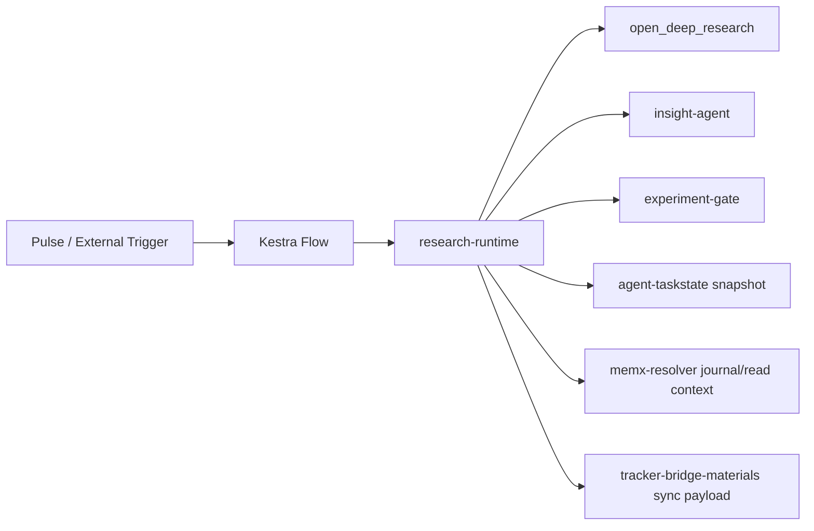

# RanD Specification

## 0. 文書情報

- 文書種別: specification
- 状態: active
- 対象: `RanD` root, `research-runtime`, `kestra/flows`
- 対応要求: [requirements.md](requirements.md)

## 1. 位置づけ

本書は RanD の実装構成、artifact 契約、status 判定、heartbeat ルール、外部 repo 連携契約を定義する。

参照順:

- [architecture.md](architecture.md)
- [requirements.md](requirements.md)
- [evaluation.md](evaluation.md)

## 2. システム構成



## 3. Installer 仕様

### 3.1 Manifest

各 component は次を持つ。

```json
{
  "name": "insight-agent",
  "pathKey": "CODEX_DEV_ROOT",
  "relativePath": "insight-agent",
  "envVar": "RAND_LOCAL_PATH_INSIGHT_AGENT",
  "remoteUrl": "https://github.com/RNA4219/insight-agent.git",
  "installSubdir": "repos/insight-agent",
  "pinnedCommit": "<commit>",
  "required": true
}
```

### 3.2 local path 解決規則

1. `config/localPathOverrides.json`
2. `.installed/config/localPathOverrides.json`
3. `envVar`
4. `pathKey + relativePath`
5. `remoteUrl`

`pathKey` の正本は `CODEX_DEV_ROOT` とする。

### 3.3 install mode

| Mode | 挙動 |
| --- | --- |
| `local` | local path が解決できない component は warning 付きで skip |
| `auto` | local path が使えれば local clone、無ければ remote fallback |
| `remote` | 常に remote clone |

## 4. Runtime 仕様

### 4.1 実行入口

- `python -m rand_research.cli run-once --preset <name> [--max-items N]`
- `python -m rand_research.cli run-schedule`
- `python -m rand_research.cli heartbeat [--preset <name>] [--dry-run] [--summary-only]`
- `python -m rand_research.cli env-check`

### 4.2 preset

| preset | 種別 | 説明 |
| --- | --- | --- |
| `paper_arxiv_ai_recent` | single | arXiv cs.AI recent と論文補助ソースを巡回 |
| `ai_news_official` | single | 主要 AI 公式ニュースを巡回 |
| `ai_watch_daily` | composed | 上記 2 preset の合成 |

### 4.3 heartbeat ルール

`configs/heartbeat.json` を正本とする。現行ルールは JST で次の通り。

| 条件 | preset |
| --- | --- |
| 08:00-11:59 | `ai_watch_daily` |
| 21:00-23:59 | `paper_arxiv_ai_recent` |
| その他 | `paper_arxiv_ai_recent` |
| CLI で `--preset` 明示 | 明示 preset を最優先 |

補足:

- `configs/heartbeat.json` は時刻に応じた preset 選択規則の正本である。
- Kestra の定時実行時刻は flow ごとの `Schedule` trigger が持つ。
- 定時実行 flow は `timezone: "Asia/Tokyo"` を明示する。
- `research-heartbeat.yaml` は event/manual 起点で preset を補完するための flow であり、定時巡回の正本ではない。

### 4.4 status 判定

run 全体の `status` は `dependency_health` と `status_reason` から決める。

- `failed`
  - `sources=failed`
  - `state=failed`
  - `report_save_failed` を含む
- `degraded`
  - 上記 failed 条件ではないが、いずれかの dependency が `ok` 以外
  - または `status_reason` が 1 つ以上ある
- `ok`
  - すべての dependency が `ok`
  - `status_reason` が空

taskstate への写像:

- `ok -> done`
- `degraded -> needs_review`
- `failed -> failed`

### 4.5 composed preset の集約

`ai_watch_daily` のような composed preset は child preset を順に実行し、child report を集約する。

- child 1 件でも `degraded` があれば parent は最低 `degraded`
- child がすべて `failed` なら parent は `failed`
- 収集 item は child report の `collected_items` を結合し、実行 context を再適用する

## 5. Artifact 仕様

### 5.1 固定 artifact

1 run につき次を保存する。

- `report.md`
- `report.json`
- `insight.json`
- `gate.json`
- `meta.json`
- `memx_journal.json`
- `tracker_sync.json`
- `state_context.json`

### 5.2 schema version

すべての JSON artifact は root に `schema_version` を持つ。初版は `"1.0"` とする。

- `report.json`
  - 必須: `schema_version`, `status`, `status_reason`, `state_context`, `artifacts`, `dependency_health`
- `state_context.json`
  - 必須: `schema_version`, `before`, `after`
- `meta.json`
  - 必須: `schema_version`, `status`, `status_reason`, `dependency_health`
- `memx_journal.json`
  - root と各 `entry` の両方に `schema_version`
- `tracker_sync.json`
  - root と各 `event` の両方に `schema_version`

### 5.3 compatibility policy

- additive change は minor 更新として扱う
- required field の削除、既存 field の意味変更、status 判定規則の破壊的変更は major 更新として扱う

## 6. 外部 repo 契約

### 6.1 agent-taskstate

RanD は local snapshot を読み書きする。必要最小キー:

- `task_id`
- `run_id`
- `preset`
- `status`
- `updated_at`
- `summary`
- `status_reason`
- `artifacts`

### 6.2 memx-resolver

RanD は local journal を読む。必要最小キー:

- root: `schema_version`, `entries`
- entry: `schema_version`, `entry_id`, `scope`, `recorded_at`, `summary`, `sources`, `artifacts`, `status`, `error`

### 6.3 tracker-bridge-materials

RanD は sync payload を生成する。必要最小キー:

- root: `schema_version`, `events`
- event: `schema_version`, `sync_id`, `recorded_at`, `preset`, `items`, `gate_recommendations`, `status`, `error`

## 7. テスト戦略

- unit test の正本は fixture ベースの fetcher テストとする
- live fetch や live LLM 実行は受け入れ基準の必須にはしない
- 最低限の回帰対象
  - arXiv HTML
  - OpenAI / Anthropic / DeepMind RSS
  - generic link scraping
  - heartbeat 選択
  - report schema
  - status 集約
