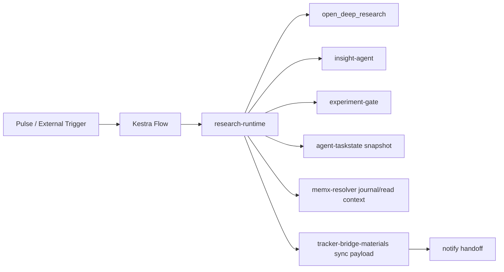

# RanD Specification

## 0. 文書情報

- 文書種別: specification
- 状態: active
- 対象: `RanD` root, `research-runtime`, `kestra/flows`
- 対応要求: [requirements.md](requirements.md)

## 1. 位置づけ

本書は RanD の実装構成、artifact 契約、status 判定、heartbeat ルール、外部 repo 連携契約、および通常運転時の正規チェーンを定義する。

参照順:

- [architecture.md](architecture.md)
- [requirements.md](requirements.md)
- [evaluation.md](evaluation.md)

## 2. システム構成


```mermaid
flowchart LR
    A["Pulse / External Trigger"] --> B["Kestra Flow"]
    B --> C["research-runtime"]
    C --> D["open_deep_research"]
    C --> E["insight-agent"]
    C --> F["experiment-gate"]
    C --> G["agent-taskstate snapshot"]
    C --> H["memx-resolver journal/read context"]
    C --> I["tracker-bridge-materials sync payload"]
    I --> J["notify handoff"]
```

## 2.1 正規チェーン

通常運転の正規経路は `research -> insight -> gate -> sync -> notify` とする。

- `RanD` は chaining 順序と handoff 契約を束ねる母艦である。
- replay は途中 stage から再開可能とする。
- `agent-taskstate` は run / state / decision の正本とする。
- `memx-resolver` は knowledge / read history の正本とする。
- `tracker-bridge-materials` は外部同期 payload の反映先とする。

## 3. Installer 仕様

### 3.1 Manifest

各 component は次を持つ。

```json
{
  "name": "insight-agent",
  "pathKey": "CODEX_DEV_ROOT",
  "relativePath": "insight-agent",
  "envVar": "RAND_LOCAL_PATH_INSIGHT_AGENT",
  "remoteUrl": "https://github.com/RNA4219/insight-agent.git",
  "installSubdir": "repos/insight-agent",
  "pinnedCommit": "<commit>",
  "required": true
}
```

### 3.2 local path 解決規則

1. `config/localPathOverrides.json`
2. `.installed/config/localPathOverrides.json`
3. `envVar`
4. `pathKey + relativePath`
5. `remoteUrl`

`pathKey` の正本は `CODEX_DEV_ROOT` とする。

### 3.3 install mode

| Mode | 挙動 |
| --- | --- |
| `local` | local path が解決できない component は warning 付きで skip |
| `auto` | local path が使えれば local clone、無ければ remote fallback |
| `remote` | 常に remote clone |

## 4. Runtime 仕様

### 4.1 実行入口

- `python -m rand_research.cli run-once --preset <name> [--max-items N]`
- `python -m rand_research.cli run-schedule`
- `python -m rand_research.cli heartbeat [--preset <name>] [--dry-run] [--summary-only]`
- `python -m rand_research.cli env-check`

macOS / Linux では次の shell 入口も提供する。

- `./run-research-once.sh [preset]`
- `./run-research-schedule.sh`
- `./research-runtime/scripts/env-check.sh`
- `./install-r-and-d-agent.sh`

`install-r-and-d-agent.sh` は既存 PowerShell installer を `pwsh` 経由で呼ぶ薄い wrapper とし、install 実体の重複を避ける。

### 4.2 preset

| preset | 種別 | 説明 |
| --- | --- | --- |
| `paper_arxiv_ai_recent` | single | arXiv cs.AI recent と論文補助ソースを巡回 |
| `ai_news_official` | single | 主要 AI 公式ニュースを巡回 |
| `ai_watch_daily` | composed | 上記 2 preset の合成 |
| `kano_requirements_hybrid` | single | query family から Kano evidence seed を生成し、要求定義 packet を作る |
| `kano_requirements_offline_eval` | single | fixture evidence で KanoMode の artifact 契約を再現検証する |

補足:

- preset は `insight_enabled: false` を指定できる。
- KanoMode MVP は deterministic な evidence-to-packet 変換を正本とし、offline eval では `insight-agent` の有無で status が揺れないよう `insight_enabled: false` を使う。

### 4.3 heartbeat ルール

`configs/heartbeat.json` を正本とする。現行ルールは JST で次の通り。

| 条件 | preset |
| --- | --- |
| 08:00-11:59 | `ai_watch_daily` |
| 21:00-23:59 | `paper_arxiv_ai_recent` |
| その他 | `paper_arxiv_ai_recent` |
| CLI で `--preset` 明示 | 明示 preset を最優先 |

補足:

- `configs/heartbeat.json` は時刻に応じた preset 選択規則の正本である。
- Kestra の定時実行時刻は flow ごとの `Schedule` trigger が持つ。
- 定時実行 flow は `timezone: "Asia/Tokyo"` を明示する。
- `research-heartbeat.yaml` は event/manual 起点で preset を補完するための flow であり、定時巡回の正本ではない。

### 4.4 status 判定

run 全体の `status` は `dependency_health` と `status_reason` から決める。

- `failed`
  - `sources=failed`
  - `state=failed`
  - `report=failed`
  - `report_save_failed` を含む
- `degraded`
  - 上記 failed 条件ではないが、いずれかの dependency が `ok` 以外
  - または `status_reason` が 1 つ以上ある
- `ok`
  - すべての dependency が `ok`
  - `status_reason` が空

taskstate への写像:

- `ok -> done`
- `degraded -> needs_review`
- `failed -> failed`

### 4.5 composed preset の集約

`ai_watch_daily` のような composed preset は child preset を順に実行し、child report を集約する。

- child 1 件でも `degraded` があれば parent は最低 `degraded`
- child がすべて `failed` なら parent は `failed`
- 収集 item は child report の `collected_items` を結合し、実行 context を再適用する

## 5. Artifact 仕様

### 5.1 固定 artifact

1 run につき次を保存する。

- `report.md`
- `report.json`
- `insight.json`
- `gate.json`
- `meta.json`
- `memx_journal.json`
- `tracker_sync.json`
- `state_context.json`

KanoMode preset では、固定 artifact に加えて次を保存する。

- `kano.json`
- `requirements_packet.json`
- `downstream_handoff.json`

KanoMode audit preset では、固定 artifact に加えて次を保存する。

- `kano.json`
- `requirements_audit_packet.json`
- `downstream_handoff.json`

### 5.2 schema version

すべての JSON artifact は root に `schema_version` を持つ。初版は `"1.0"` とする。

- `report.json`
  - 必須: `schema_version`, `status`, `status_reason`, `state_context`, `artifacts`, `dependency_health`
  - `dependency_health` は少なくとも `sources`, `state`, `report`, `insight`, `gate`, `memx`, `tracker` を持つ
- `state_context.json`
  - 必須: `schema_version`, `before`, `after`
- `meta.json`
  - 必須: `schema_version`, `status`, `status_reason`, `dependency_health`
- `memx_journal.json`
  - root と各 `entry` の両方に `schema_version`
- `tracker_sync.json`
  - root と各 `event` の両方に `schema_version`
- `kano.json`
  - 必須: `schema_version`, `mode`, `request_id`, `topic`, `persona_modes`, `source_summary`, `kano_candidates`
  - 各 candidate は `candidate_id`, `statement`, `kano_type`, `confidence`, `evidence`, `persona_votes`, `bias_note`, `kill_condition` を持つ
- `requirements_packet.json`
  - 必須: `schema_version`, `packet_id`, `derived_from`, `product_context`, `requirements`, `release_readiness_prelude`, `qeg_policy_hash_ref`
  - `packet_id` と各 `requirement_id` は `rand:` prefix 付き ID とする
  - 各 requirement は `requirement_id`, `statement`, `kano_type`, `priority`, `confidence`, `evidence_refs`, `kpi`, `acceptance_criteria`, `risks`, `downstream_hooks`, `gate_policy_proposal` を持つ
  - `gate_policy_proposal` は QEG policy 正本への提案であり、QEG policyHash 参照を併記する
  - `confidence`, `bias_note`, `kill_condition` が欠ける candidate は packet に昇格しない
- `downstream_handoff.json`
  - 必須: `schema_version`, `handoff_id`, `mode`, `workflow_cookbook`, `manual_bb_test_harness`, `code_to_gate`, `tracker_bridge`, `status`, `delivery`, `error`
  - `handoff_id` は `rand:` prefix 付き ID とする
  - `status` は `dry_run`, `shadow`, `live` のいずれかとし、未指定時は `dry_run` とする
  - `dry_run` は実送信も送信内容の通電記録も行わない
  - `shadow` は送信内容を記録するが実送信しない
  - `live` は明示設定時のみ送信し、成功 / 失敗 / 宛先受理 verdict を `delivery` に残す

### 5.3 compatibility policy

- additive change は minor 更新として扱う
- required field の削除、既存 field の意味変更、status 判定規則の破壊的変更は major 更新として扱う

### 5.4 artifact validation CLI

保存済み JSON artifact は `python -m rand_research.cli validate-artifact --path <path> [--type <type>]` で必須 field と `schema_version` を検査できる。

- `--type` 未指定時は file name から artifact type を推定する
- `report`, `state_context`, `memx_journal`, `tracker_sync`, `kano`, `requirements_packet`, `requirements_audit_packet`, `downstream_handoff`, `operations_state` を対象にする
- `memx_journal.entries[*]` と `tracker_sync.events[*]` は入れ子の `schema_version` も検査する

## 6. 外部 repo 契約

### 6.0 Insight / Gate 実行順序

Insight / Gate は次の順で実行する。

1. 外部 API
   - Insight: `RAND_INSIGHT_API_URL`
   - Gate: `RAND_GATE_API_URL`
   - 任意 token: `RAND_INSIGHT_API_TOKEN`, `RAND_GATE_API_TOKEN`
2. サブエージェント fallback
   - Insight: `RAND_INSIGHT_SUBAGENT_CMD`
   - Gate: `RAND_GATE_SUBAGENT_CMD`
   - API 失敗または peer repo import 失敗時に、同一 request payload を stdin JSON で渡す
3. peer repo の Python API
   - `insight_core.run(request_dict=...)`
   - `experiment_gate.run_gate(request=...)`
4. deterministic fallback
   - repo / API / subagent が使えない場合でも artifact 契約を満たし、`status=degraded` として保存する

API / サブエージェントの実行結果は `results` 配列を返すことを期待する。`status` が root に無い場合は、各 result の `status` または `run.status` から集約する。timeout は `RAND_INTEGRATION_TIMEOUT_SECONDS` で上書きでき、未指定時は 30 秒以上を保証する。

### 6.1 agent-taskstate

RanD は local snapshot を読み書きする。必要最小キー:

- `task_id`
- `run_id`
- `preset`
- `status`
- `updated_at`
- `summary`
- `status_reason`
- `artifacts`

### 6.2 memx-resolver

RanD は local journal を読む。必要最小キー:

- root: `schema_version`, `entries`
- entry: `schema_version`, `entry_id`, `scope`, `recorded_at`, `summary`, `sources`, `artifacts`, `status`, `error`

### 6.3 tracker-bridge-materials

RanD は sync payload を生成する。必要最小キー:

- root: `schema_version`, `events`
- event: `schema_version`, `sync_id`, `recorded_at`, `preset`, `items`, `gate_recommendations`, `status`, `error`

### 6.4 pulse-kestra 制御面契約

RanD を常時運転へ接続する制御面は `pulse-kestra` が担う。現状契約は次とする。

- heartbeat は stuck task、pending / failed reply、retry candidate の軽量巡回に限定する
- manual replay は `task_id` または `trace_id` 起点で途中 stage から再開できる
- notifier resend は保存済み `reply_text` を再利用して worker 再実行なしで動く
- duplicate suppression は `note`, `reply`, `replay` の 3 種 key を使う
- replay / resend / duplicate suppression の件数は `pulse-kestra` の flow output と taskstate field を集計元にする

### 6.4.1 operations state 境界

`research-runtime/state/operations-state.json` は RanD runtime local の operations outbox 正本である。

- runtime は notification outbox、dedupe key、replay plan を `operations-state.json` に保存する
- Kestra heartbeat は `metrics`, `resend-pending`, `replay-plan` CLI を通じて operations state を読む
- `pulse-kestra` は配送・外部投稿の実行面を担い、runtime local state を直接の外部送信結果としては扱わない
- 外部送信結果を反映する場合は `mark-notification` CLI で `sent / failed` を明示更新する
- `agent-taskstate` は run / task 状態の正本であり、operations state は通知・再送・replay 計画の補助正本として分離する

### 6.4.2 pilot readiness gate

`python -m rand_research.cli pilot-check` は pilot runtime の軽量 gate とする。

- latest run の `report.json` を検査し、最新 status が `failed` の場合は `no_go` とする
- latest run に `downstream_handoff.json` があれば schema を検査し、無い場合は `degraded` とする
- `operations-state.json` の schema を検査する
- heartbeat config が読め、`default_preset` と `rules` を持つことを検査する
- metrics から run history、pending / failed notification、tracker sync failure を確認する
- 返却 status は `go / degraded / no_go` とし、`degraded` は人間レビュー付きで pilot 継続可能な状態を表す

`python -m rand_research.cli pilot-status` は pilot runtime の運用入口とする。

- `pilot-check` と `outbox-plan` を集約する
- latest snapshot / latest review の path を返す
- `next_steps` に `review_outbox`, `capture_snapshot`, `record_review`, `inspect_blockers`, `continue_pilot` のいずれかを返す
- 各 next step は理由と次に実行する CLI command を持つ
- latest review が latest snapshot を `accept` または `accept_with_review` でカバーしている場合は、pending outbox が残っていても `continue_pilot_with_review` を返せる
- `--summary-only` は日次確認向けに `status`, `latest_run_id`, `pending_outbox_count`, `latest_review_decision`, `next_step`, `next_command` の短い JSON を返す

### 6.4.3 notification outbox remediation

`python -m rand_research.cli outbox-plan` は `operations-state.json` の pending / failed notification を読み、状態を書き換えずに remediation plan を返す。

- `send_or_mark_sent`: attempt がない pending notification。外部配送後に `mark-notification --status sent` または `--status failed` で反映する
- `confirm_delivery`: attempt 済みの pending notification。外部側の配送結果を確認してから `mark-notification` する
- `review_failure`: failed notification。`error` を確認し、再送または失敗確定を判断する
- `pilot-check` が `notification_outbox` warning を返す場合、detail に `outbox-plan` を remediation command として含める

### 6.4.4 pilot snapshot

`python -m rand_research.cli pilot-snapshot` は、pilot runtime の時点証跡として `pilot_snapshot` artifact を保存する。

- 既定の保存先は `research-runtime/state/pilot-snapshots/pilot-snapshot-*.json` とする
- artifact は `schema_version`, `snapshot_id`, `type`, `captured_at`, `status`, `latest_run_id`, `pilot_check`, `outbox_plan`, `metrics`, `review_required` を持つ
- `status` は `pilot-check` の `go / degraded / no_go` を引き継ぐ
- `review_required` は `status != go` または pending outbox がある場合に `true` とする
- `--dry-run` は保存せず snapshot payload だけを返す

### 6.4.5 pilot review

`python -m rand_research.cli pilot-review --snapshot <path> --decision <decision>` は、snapshot に対する運用判断を `pilot_review` artifact として保存する。

- 既定の保存先は `<snapshot>.review.json` とする
- `decision` は `accept`, `accept_with_review`, `hold`, `block` のいずれかとする
- artifact は `schema_version`, `review_id`, `type`, `reviewed_at`, `reviewer`, `decision`, `notes`, `snapshot_ref`, `required_followups`, `review_required` を持つ
- `required_followups` は `pilot-check` の warning / failure と `outbox-plan` の action を引き継ぐ
- `accept_with_review`, `hold`, `block` は `review_required=true` とする

`python -m rand_research.cli pilot-accept` は、現在状態の `pilot-snapshot` と `pilot-review` を連続して保存する日次運用向けショートカットとする。

- 既定 decision は `accept_with_review` とする
- snapshot と review は `state/pilot-snapshots/` に保存する
- 出力は `snapshot_path`, `review_path`, `snapshot_status`, `decision`, `required_followup_count` を持つ

## 6.5 最小観測点

ダッシュボード自体は本仕様の対象外とするが、次の指標を後から集計できる field / log を保持しなければならない。

- 日次 run 数
- `ok / degraded / failed` 件数
- `report_save_failed` 件数
- `state_write_failed` 件数
- replay 実行件数
- 未通知再送件数
- notification failure 件数
- tracker sync failure 件数
- duplicate suppression 件数
- downstream handoff mode 件数
- downstream live success / failure 件数
- downstream 宛先受理 verdict 件数

`RanD` 単体では `status`, `status_reason`, `dependency_health`, `tracker_sync_refs`, `downstream_handoff.delivery` を集計元とし、通知・再送・重複抑止の詳細は `pulse-kestra` 側の flow output、taskstate field、dedupe metadata で補完する。

## 7. テスト戦略

- unit test の正本は fixture ベースの fetcher テストとする
- live fetch や live LLM 実行は受け入れ基準の必須にはしない
- 外部 API / サブエージェント fallback は mock による unit test を正本にし、live API は受け入れ必須にしない
- KanoMode の通常検証は `kano_requirements_offline_eval` と `tests/fixtures/kano_evidence.json` を正本にする
- 最低限の回帰対象
  - arXiv HTML
  - OpenAI / Anthropic / DeepMind RSS
  - generic link scraping
  - heartbeat 選択
  - report schema
  - status 集約
  - Kano query seed / fixture / requirements packet
